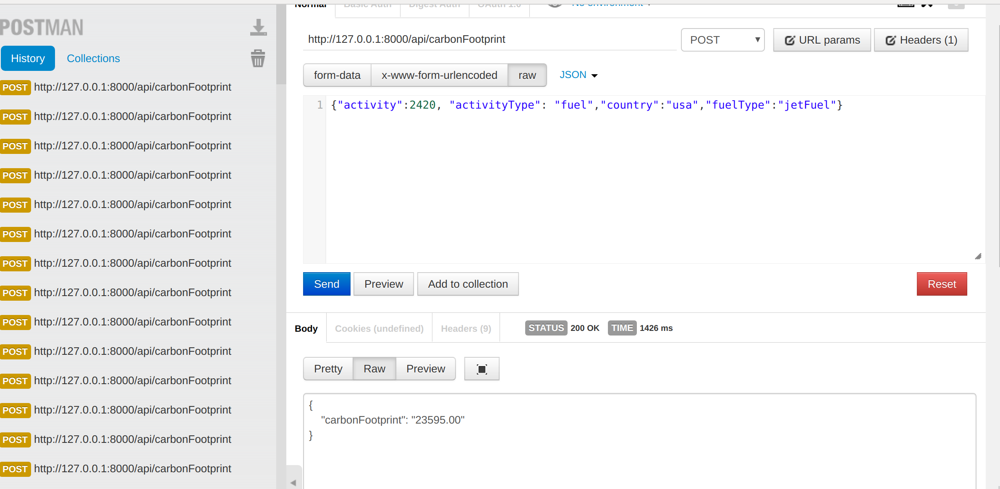

Please follow below steps to test this application.

1. Clone this app.
2. Copy .env.example file to .env file.
3. Edit .env file to change appropriate database name, username and password.
4. Run "php artisan migrate" command. This will create required table "carbon" into database.
5. Run "php artisan serve" command. Open postman or anyother API testing tool and test api "http://127.0.0.1:8000/api/carbonFootprint".

Please see below image for the reference.

